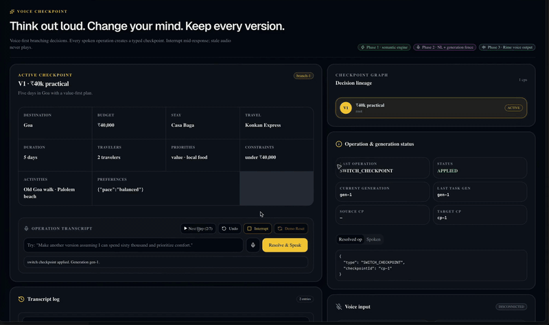
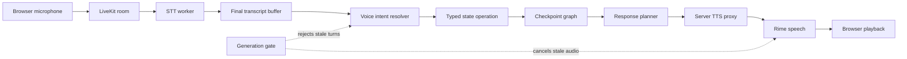

<div align="center">

# 🎙️ Voice Checkpoint

### Think out loud. Change your mind. Keep every version.

**Voice-native version control for decisions.** Speak a plan, branch into an alternative, compare versions, merge one detail, and undo without losing your reasoning.

<a href="https://github.com/AnshulAlgoS/Voice-Checkpoint/releases/download/demo-v1/voice-checkpoint-demo.mp4">
  
</a>

<br />

[](#proof)
[](#architecture)
[](#architecture)
[](#architecture)

**[▶ Watch with narration](https://github.com/AnshulAlgoS/Voice-Checkpoint/releases/download/demo-v1/voice-checkpoint-demo.mp4)** · **[🎙 Run it yourself](#try-it)** · **[🧠 Explore the architecture](#architecture)** · **[🧪 See the evidence](RIME_EVIDENCE.md)**

</div>

---

Voice Checkpoint treats a conversation like version control. The demo uses a Goa trip because the result is easy to see, but the state engine is generic. The same graph can manage product requirements, event plans, budgets, research decisions, hiring criteria, or any other structured decision.

> [!TIP]
> Click the animated preview to download the full 1080p narrated demo. Expand the sections below to inspect the live voice path and its guarantees.

## 🧭 Why this exists

Voice assistants usually overwrite context. When someone says “try a more comfortable version,” the old plan disappears into chat history. A later request such as “keep the original budget, but take the new hotel” forces the assistant to reconstruct state from prose and hope it understood the references correctly.

Voice Checkpoint makes those changes explicit:

- Every accepted command becomes a typed state operation.
- Every meaningful version becomes an immutable checkpoint.
- Branches remain isolated, so experimentation cannot corrupt the original.
- Comparisons work on semantic fields instead of text.
- Selective merge copies only the requested fields.
- Undo restores the exact graph snapshot, including the active checkpoint.

## ✨ What makes it different

Most voice products optimize the conversation. Voice Checkpoint protects the **decision state behind the conversation**.

| Typical assistant | Voice Checkpoint |
|---|---|
| Rewrites a plan in chat | Creates an immutable branch |
| Describes differences in prose | Computes a field-level semantic diff |
| Copies an entire answer | Merges only selected state paths |
| “Undo” generates another answer | Restores the exact previous graph |
| Late audio can overwrite a newer turn | Generation fencing rejects stale work |
| Domain data is embedded in UI logic | Generic JSON-compatible semantic state |

This makes voice safe for exploratory work. Users can ask “what if?”, inspect the consequences, keep one detail, and return to any previous decision without starting over.

## 🎬 See the state graph move

<details open>
<summary><strong>▶ Run the seven spoken moves</strong></summary>

<br />

Say these commands in order:

1. **“Plan a five-day trip to Goa for forty thousand rupees.”**
2. **“Make another version assuming I can spend sixty thousand and prioritize comfort.”**
3. **“Compare this with the original.”**
4. **“Go back to the original.”**
5. **“Take the hotel from the luxury version but don't change anything else.”**
6. **“What changed?”**
7. **“Undo that.”**

The decisive moment is step five. The active branch adopts **Taj Fort Aguada** from the comfort branch while keeping the original **₹40,000 budget** and **Konkan Express**. Undo then restores the complete pre-merge graph exactly. Version two remains available throughout.

</details>

<a id="architecture"></a>

## 🧠 Explore the system



<details>
<summary><strong>Open the integration deep dive</strong></summary>

<br />

### 1. LiveKit carries realtime speech

The browser joins a short-lived LiveKit room and publishes the microphone track. A Python worker named `voice-checkpoint-transcriber` subscribes to that room, uses LiveKit Inference with `deepgram/nova-3-general`, and publishes transcription events back to the browser.

Live speech engines can emit one sentence as several final segments. The input adapter buffers consecutive final segments for 1.5 seconds and submits them as one command, so:

```text
“Make another version assuming I can spend sixty thousand”
“and prioritize comfort”
```

becomes one fork containing both the ₹60,000 budget and the comfort priority.

### 2. The resolver produces typed operations

Speech never mutates application state directly. `VoiceIntentResolver` maps a transcript to one of the engine’s operations:

```ts
type StateOperation<T> =
  | { type: 'FORK'; sourceCheckpointId: string; changes: Partial<T> }
  | { type: 'SWITCH_CHECKPOINT'; checkpointId: string }
  | { type: 'COMPARE'; fromCheckpointId: string; toCheckpointId: string }
  | { type: 'MERGE'; sourceCheckpointId: string; targetCheckpointId: string; fields: string[] }
  | { type: 'UPDATE_STATE'; checkpointId: string; changes: Partial<T> }
  | { type: 'REWIND'; steps: number }
  | { type: 'UNDO' };
```

Ambiguous references return a clarification result without mutating the graph. Unsupported commands also leave state untouched.

### 3. The semantic engine owns truth

`StateGraph` is the only layer allowed to change semantic state. It delegates comparison and selective copying to `DiffEngine` and `MergeEngine`. Checkpoints contain cloned structured state, ancestry, branch identity, version number, timestamps, and the instruction that produced them.

The engine does not know about trips, microphones, or speech providers. Any JSON-compatible record can be checkpointed:

```ts
const graph = new StateGraph({
  repository: 'mobile-app',
  strategy: 'incremental rollout',
  risk: 2,
});
```

### 4. Rime speaks the committed result

After an operation is accepted, `ResponsePlanner` creates a concise spoken confirmation. The browser sends it to `POST /api/rime-tts`; the server adds the private Rime credential and streams the returned MP3 back for playback.

The credential never enters the client bundle. There is no browser speech fallback in the production provider, so a successful spoken response is evidence that the Rime path ran.

### 5. Generation fencing makes interruption safe

Every turn receives a monotonically increasing generation token. Starting a newer turn immediately invalidates older resolver work and aborts older speech requests. Before state mutation and before playback, the pipeline verifies that the generation and checkpoint are still current.

This prevents the classic realtime race where a slow response from an old command speaks over or mutates a newer decision.

</details>

<a id="try-it"></a>

## 🎙️ Try it yourself

### Requirements

- Node.js **22.13 or newer**
- Python **3.11 or newer**
- A Rime API key
- A LiveKit Cloud URL, API key, and API secret
- Browser microphone permission for `localhost`

### Install

```bash
nvm install
nvm use
npm install
python3 -m venv .venv
source .venv/bin/activate
pip install -r requirements-voice.txt
cp .env.example .env.local
```

Add your credentials to `.env.local`. Keep the variable names exactly as shown in `.env.example`.

### Start the complete voice stack

```bash
npm run dev:voice
```

This command validates Node, checks the required environment values and Python packages, then starts both the web app and the LiveKit transcription worker. Pressing `Ctrl+C` stops both.

Open [http://localhost:3000](http://localhost:3000), then:

1. Click the microphone button beside **Resolve & Speak**.
2. Allow microphone access when the browser asks.
3. Wait for **LIVEKIT LIVE**, **CONNECTED**, and **CAPTURING**.
4. Speak one complete command at a natural pace.
5. Watch interim words appear in cyan, followed by the resolved operation, graph update, and spoken response.

You can also type into the same command box and click **Resolve & Speak**. Typed and spoken commands pass through the same resolver, state engine, generation gate, and Rime output path.

<details>
<summary><strong>🛠 Microphone troubleshooting</strong></summary>

<br />

## Why the microphone may appear to do nothing

Running `npm run dev` starts only the website. It does not start the Python transcription worker. In that state, the browser may connect and publish audio, but nobody is present in the room to turn that audio into text. Use `npm run dev:voice` for an interactive voice session.

| Symptom | Cause | Fix |
|---|---|---|
| Page does not start and mentions `fs/promises` or `glob` | Node is too old | Install Node 22.13+ and run `node --version` |
| Token endpoint reports missing credentials | `.env.local` is absent or incomplete | Copy `.env.example` and fill the four required credentials |
| Status is connected and capturing, but no words appear | STT worker is not running or registered | Stop the processes and restart with `npm run dev:voice` |
| Browser denies the microphone | Site permission is blocked | Allow microphone access for `http://localhost:3000`, then click the mic again |
| Transcript appears but no voice plays | Rime request failed or playback was blocked | Check the web terminal for the Rime request status and interact with the page once |
| Only half a sentence resolves | Pause between phrases exceeded the final-segment window | Speak the command continuously; the adapter combines segments within 1.5 seconds |

</details>

<details>
<summary><strong>🔐 Environment variables and secret boundaries</strong></summary>

<br />

## Environment variables

| Variable | Purpose | Default |
|---|---|---|
| `RIME_API_KEY` | Server-side Rime bearer credential | required |
| `RIME_ENDPOINT` | Rime synthesis endpoint | `https://users.rime.ai/v1/rime-tts` |
| `RIME_MODEL` | Rime model | `coda` |
| `RIME_VOICE` | Rime speaker | `celeste` |
| `RIME_LANGUAGE` | Speech language | `en` |
| `RIME_AUDIO_FORMAT` | Returned audio format | `mp3` |
| `LIVEKIT_URL` | LiveKit Cloud WebSocket URL | required |
| `LIVEKIT_API_KEY` | Server-side LiveKit API key | required |
| `LIVEKIT_API_SECRET` | Server-side LiveKit API secret | required |
| `LIVEKIT_AGENT_NAME` | Explicit worker dispatch name | `voice-checkpoint-transcriber` |
| `LIVEKIT_STT_MODEL` | LiveKit Inference STT model | `deepgram/nova-3-general` |

All credentials stay in ignored `.env.local`. The token route issues a short-lived room token to the browser. The LiveKit API secret and Rime API key remain server-side.

</details>

<a id="proof"></a>

## 🧪 Proof, not promises

The automated suite proves these behaviors:

- A fork cannot mutate its parent checkpoint.
- Switching restores the exact selected branch state.
- Diff classifies changed and unchanged semantic paths.
- Merge changes only the requested paths, including nested fields.
- Undo restores the complete previous graph by strict deep equality.
- Returned snapshots cannot contaminate internal graph state.
- Ambiguous language cannot mutate state.
- A stale generation cannot mutate the graph or play audio.
- Rapid supersession cancels every older in-flight voice request.
- Default LiveKit reconnects use fresh rooms so the worker is dispatched again.

Run the complete validation suite:

```bash
npm test
npx tsc --noEmit
npm run lint
npm run build
python -m py_compile voice_agent.py
```

The repository currently contains **64 deterministic tests**, including the full acceptance path and regressions for “₹60,000 and prioritize comfort” and “a trip to Kerala in fifty thousand rupees.” Live credential verification notes are documented in [RIME_EVIDENCE.md](RIME_EVIDENCE.md).

<details>
<summary><strong>🗂 Browse the project structure</strong></summary>

<br />

## Project structure

```text
app/
  api/livekit-token/     short-lived browser token endpoint
  api/rime-tts/          server-side Rime streaming proxy
  voice-checkpoint.tsx   complete interactive demo UI
lib/
  state/                 generic graph, diff, merge, undo, and value helpers
  voice/                 input, intent, references, orchestration, fencing, and output
scripts/
  dev-voice.mjs          one-command local voice stack
tests/                   Phase 1, Phase 2, and Phase 3 regression suites
voice_agent.py           LiveKit STT-only worker
evidence/                narrated demo video
```

</details>

## 🧩 Technology

- **React 19** for the interactive workspace
- **Vinext and Vite** for the application and server routes
- **TypeScript** for the engine, adapters, and UI
- **LiveKit Cloud** for realtime rooms, microphone transport, worker dispatch, and transcription events
- **LiveKit Agents for Python** for the STT worker
- **Rime** for production speech synthesis
- **Tailwind CSS and Base UI** for the interface
- **Node’s test runner** for deterministic state and pipeline tests

<details>
<summary><strong>🧱 Inspect the phase boundaries</strong></summary>

<br />

## Phase boundaries

The system is deliberately layered so integrations can evolve without weakening state correctness:

- **Phase 1:** generic semantic state, checkpoints, branch isolation, diff, selective merge, and exact undo
- **Phase 2:** natural-language commands, reference resolution, orchestration, and generation fencing
- **Phase 3:** LiveKit microphone input, STT worker, Rime output, interruption, and the polished demo UI

The Phase 1 API remains stable underneath every later integration. Voice is an interface to the engine, never a replacement for it.

</details>
